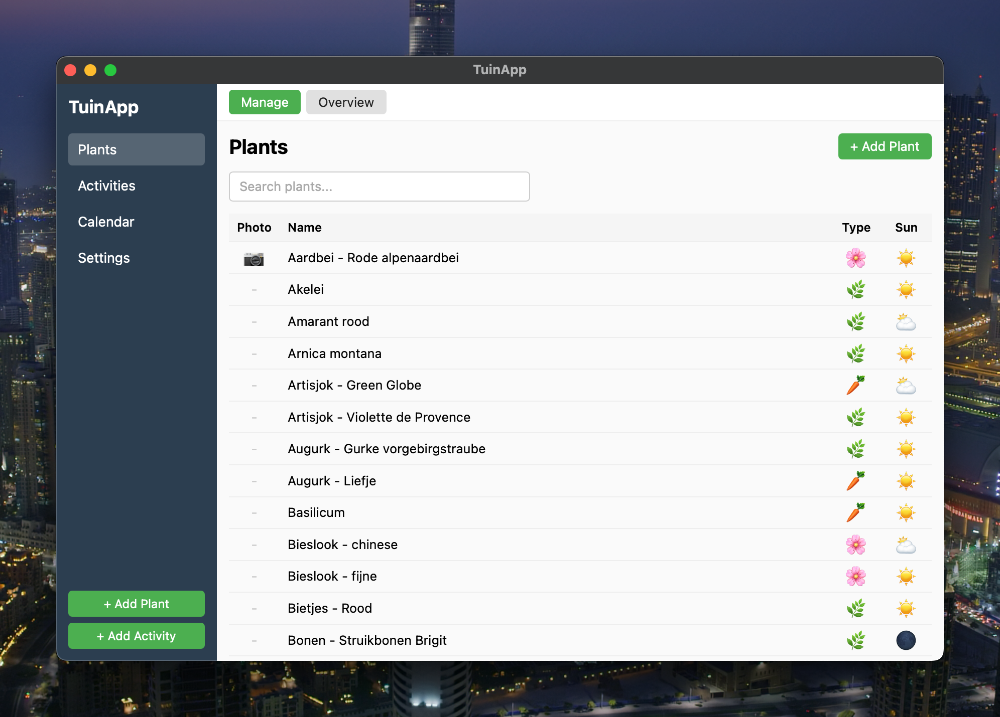
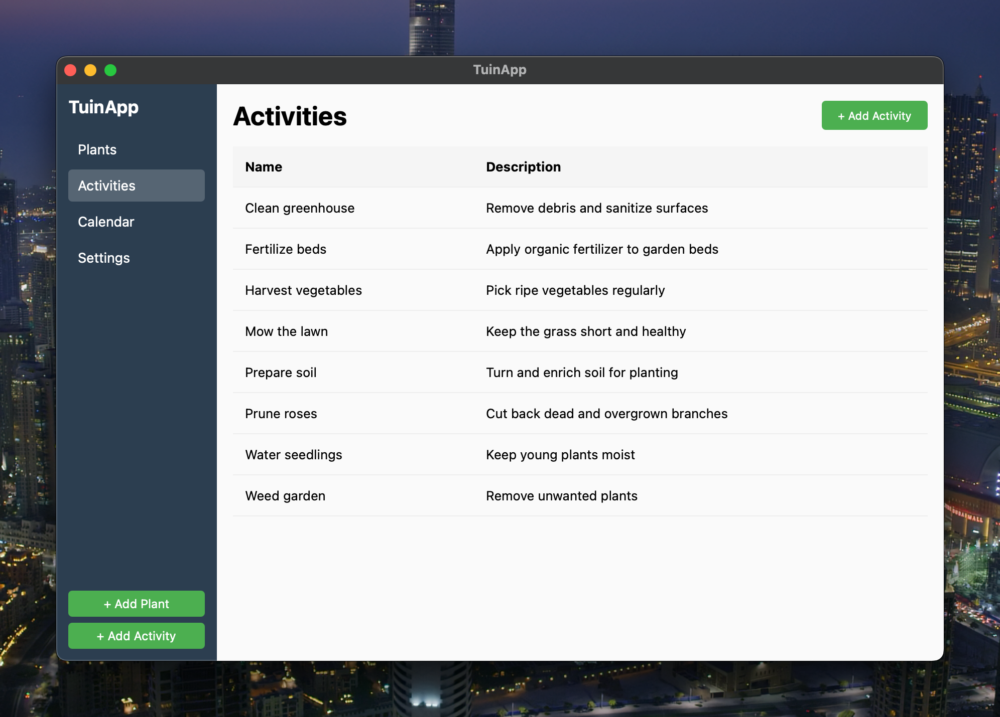

# TuinApp

A desktop garden management application for tracking plants, sowing/planting schedules, and garden activities.





## Features

- **Plant Management** - Track plants with sowing and planting periods (early/late for each month)
- **Photo Capture** - Take photos of seed packets directly from your computer's camera
- **Activity Tracking** - Manage garden activities with their active periods
- **Monthly Calendar** - See what to sow, plant, and do each month
- **Search** - Quickly find plants by name
- **TSV Import** - Import plant data from spreadsheets

## Technology Stack

- **Frontend**: Vue.js 3 with TypeScript
- **Backend**: Rust with Tauri 2
- **Database**: SQLite (single file, easy to backup)

## Development

### Prerequisites

- Node.js 20+
- Rust (install via [rustup](https://rustup.rs/))
- Tauri CLI: `cargo install tauri-cli`

### Running locally

```bash
npm install
npm run tauri dev
```

### Building for production

```bash
npm run tauri build
```

This creates a `.dmg` installer in `src-tauri/target/release/bundle/dmg/`.

## License

MIT
